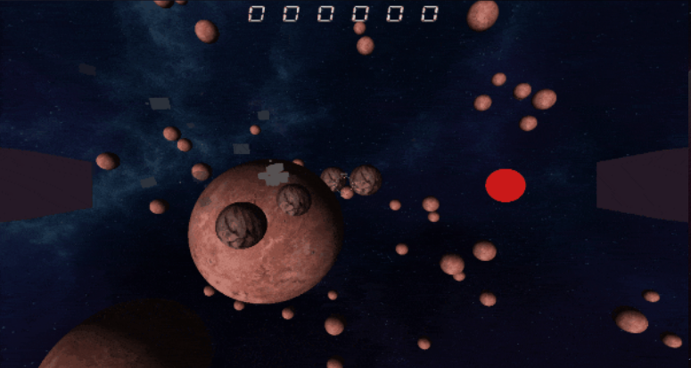

# Chokbar Engine

The main goal of this project was to create a game engine from scratch by using DirectX 12 and C++.  

## Engine Features
### Rendering

The Engine rendering contains multiple features :
* A custom shader system, we can create different shader class linked to different .hlsl files
  * Texture rendering
  * Directional lighting
* Each shader is bound to a material, bindable to a MeshRenderer
* Particle system with custom particle shader
* Primitive Mesh creation and rendering 
* Different renderers to render different types of things 
  * MeshRenderer for 3D models
  * ParticleRenderer for particles
  * SkyboxRenderer for skyboxes
  * UIRenderer for UI elements

### ECS (Entity Component System)

The engine is based on an ECS system:  
* entity with their unique ID and component signature
* component that holds the main logic of the entity (e.g., Transform, MeshRenderer, ParticleSystem)
* system registration is automatic by analysing the entity signature on each Add or Remove component

### Physics

The engine incorporates a custom physics engine with:
* sphere vs. sphere collision detection
* space partitioning using a classic grid
* bitmask to determine entities that can collide with each other

## Game Features
### Gameplay

The game is a 3D space shooter where the player controls a spaceship tasked with destroying asteroids.  

* The player can move in three dimensions without any camera lock  
* Laser shooting capability  
* Field of view changes based on the player's speed  
* Waves of asteroids spawn at regular intervals  
* The player can die and respawn  

It's also important to note that there may be existing bugs.

## Credits

### Supervisor
* [Sylvain SECCIA](https://www.seccia.com/)

### Collaborators
* [Thomas DELORME](https://github.com/generaltoto)
* [Nathanael VOGT](https://github.com/Gotvna)
* [Theo DA SILVA](https://github.com/Sinozer)

The development of this project is actually being continued by [Thomas DELORME](https://github.com/generaltoto/Views)
